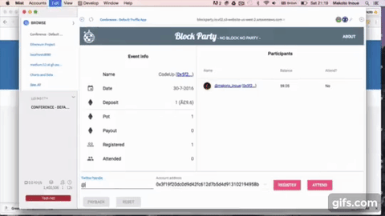

<h2>What is this?</h2>

  Have you ever encountered free party or meetup and realised that half the people registered did not actually turn up?
  BlockParty solves this problem by providing a simple incentive for people to register only if they mean it.

<h2>How does this work?</h2>

  Simple. You pay small deposit when you register. You lose your deposit if you do not turn up. You will get your deposit back + we split the deposit of whom did not turn up.
  You go to party and may end up getting more money.

  </img>

<h2> Demo </h2>

- [The demo site](http://blockparty.io.v02.s3-website-us-west-2.amazonaws.com/)
Real sites allows for participants to only `Register` and pay deposit to the site. Since this is a demo site, it allows you to `Register`, `Attend`, then press `Payback` button to simulate how it all works. Pressing `Reset` will reset the status so that you can play again.

<h2>How to setup</h2>

<h3>Option 1: access from Mist</h3>
<ul>
  <li>Step 1: Install <a href='https://github.com/ethereum/mist/releases'>Mist browser (v 0.8 or higher)</a>, and make sure you choose <em style={{fontWeight:'bold'}}>testnet</em>. Here is <a href='https://www.youtube.com/watch?v=Y3JfLgjqNU4'>a quick video tutorial</a> </li>
  <li>Step 2: Create at least 2 accounts on your wallet (so that you can simulate multiple users), and make sure you have some Ethers in both accounts. Here is the quick link on <a href='https://medium.com/@makoto_inoue/ether1-how-to-even-get-to-start-deploying-ethereum-d297cc68b5c7#.4no7evv94'> how to mine on testnet.</a> </li>
  <li>Step 3: Refresh the page </li>
</ul>

<h3>Option 2: access from normal browser</h3>
<ul>
  <li>Step 1: Install <a href='https://github.com/ethereum/mist/releases'>Mist browser (v 0.8 or higher)</a>, and make sure you choose <em style={{fontWeight:'bold'}}>testnet</em>. Here is <a href='https://www.youtube.com/watch?v=Y3JfLgjqNU4'>a quick video tutorial</a> </li>
  <li>Step 2: Create at least 2 accounts on your wallet (so that you can simulate multiple users), and make sure you have some Ethers in both accounts. Here is the quick link on <a href='https://medium.com/@makoto_inoue/ether1-how-to-even-get-to-start-deploying-ethereum-d297cc68b5c7#.4no7evv94'> how to mine on testnet.</a> </li>
  <li>Step 3: Stop Ethereum Wallet</li>
  <li>Step 4: Start geth(Go Etheruem, command line tool) with the following options. (See the <a href='https://github.com/ethereum/go-ethereum/wiki/Building-Ethereum'>installation instructions</a> for each platform)</li>
  <li>Step 5: Refresh this page </li>
</ul>
<blockquote style={{backgroundColor:'black', color:'white', padding:'1em'}}>
  geth --testnet --unlock 0,1 --rpc  --rpcapi "eth,net,web3" --rpccorsdomain http://blockparty.io.v02.s3-website-us-west-2.amazonaws.com/
</blockquote>

  NOTE:  --unlock 0 will unlock with one account.  --unlock 0 1 will unlock with two accounts.

<h2>How to play?</h2>
<ul>
  <li>Step 1: Type your twitter account, pick one of your address, then press 'Register'. It will take 10 to 30 seconds to get verified and you will receive notification.</li>
  <li>Step 2: Try registering with another account. Each time you register, you deposit 1 ETHER to the contract</li>
  <li>Step 3: Select one of the registered account and then press 'Attend'. 'Payout' seciont tells you how much you may potentially get.</li>
  <li>Step 4: Press 'Payback' button and see one of your accounts get the payout ammount.</li>
</ul>

## Hacking guide

### Prerequisite

- [geth](https://github.com/ethereum/go-ethereum/wiki/geth)
- [nodejs](https://nodejs.org/en/)
- [npm](https://www.npmjs.com/)
- [webpack](https://webpack.github.io/)
- [truffle](http://truffle.readthedocs.org) = version 2.0.4
- [testrpc](https://github.com/ethereumjs/testrpc)

### Installation

- Run `npm`

### Running test

- Run `testrpc` in one console
- Run `truffle test`

### Running locally

- Run `testrpc` in one console
- Run `truffle deploy`
- Run `truffle serve`
- Open `http://localhost:8080`

## TODO

### Testnet release candidate features

### Mainnet release candidate features

#### Essential

- Indicate once the event is end (either canceled or paid back)
- Show event location
- Show who event owner is
- Add disclaimer doc
- Upload the deployed source code to `etherscan.io`

#### Nice to have

- Replace `throw` with returning ether (better practice for handling exceptions)
- Add readonly views (so that people can see people who attended via mobile phone)
- Support metamask

### Backlog

#### Refactoring

- Add redux
- Add testing for frontend

#### New features

- Let participant to claim the payback rather than event owners to send payback
- Change payback ratio (eg: first registered, more reward)
- Let user to register by sending Ether (so that they could potentially register not via wallet but via exchange, etc)
- Automatic check in
- Waitlist
- Transfer my spot
- Refresh info when someone else register/attend
- Support metamask
